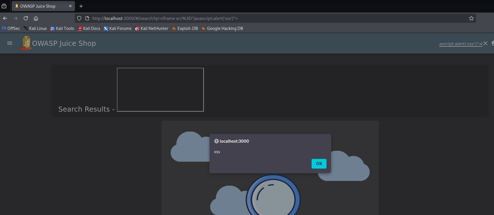
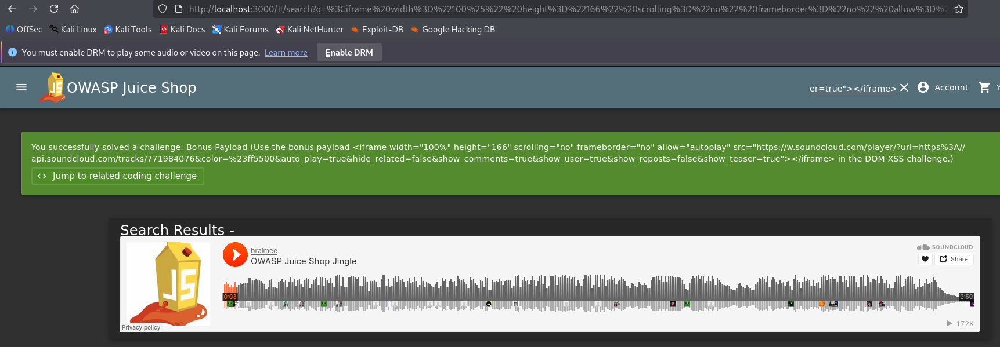
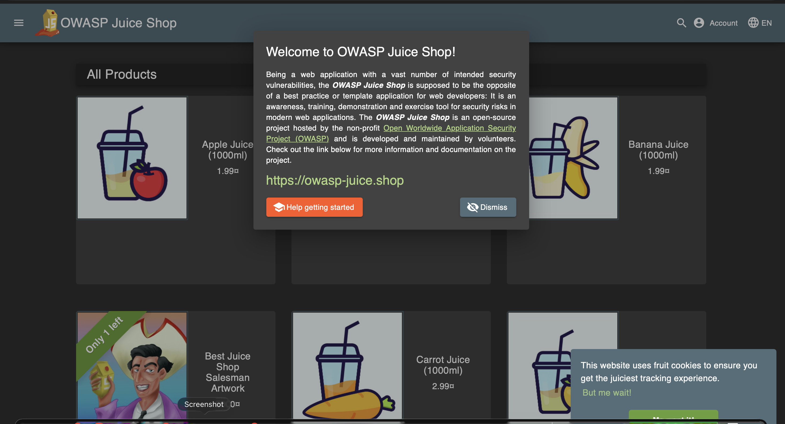
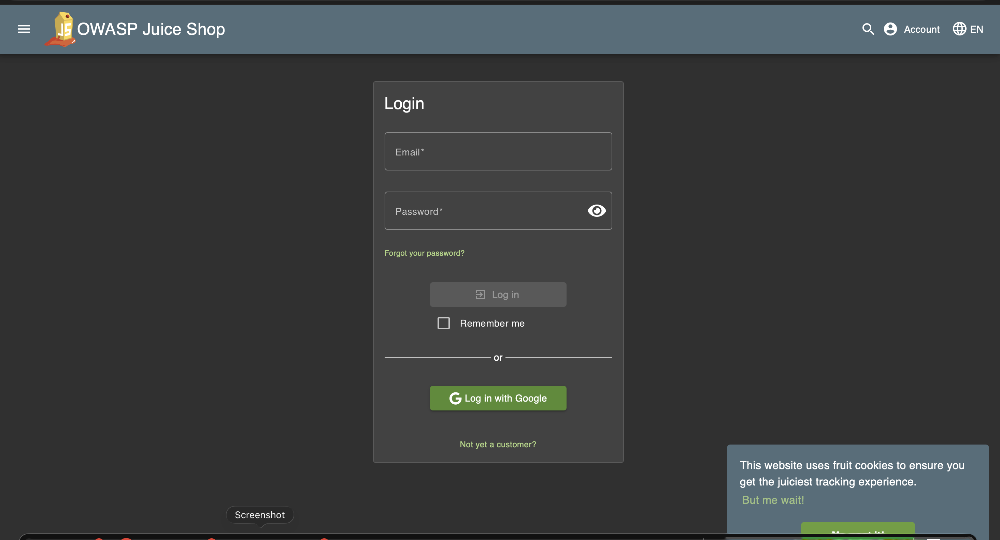
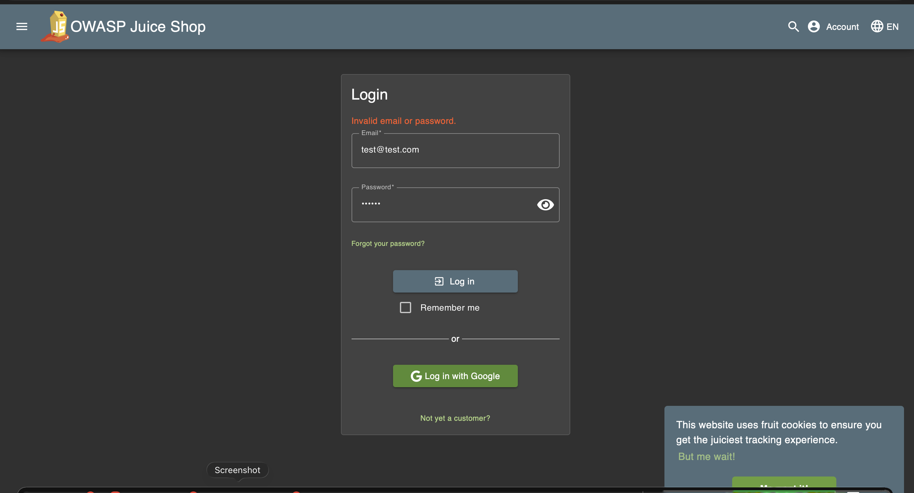
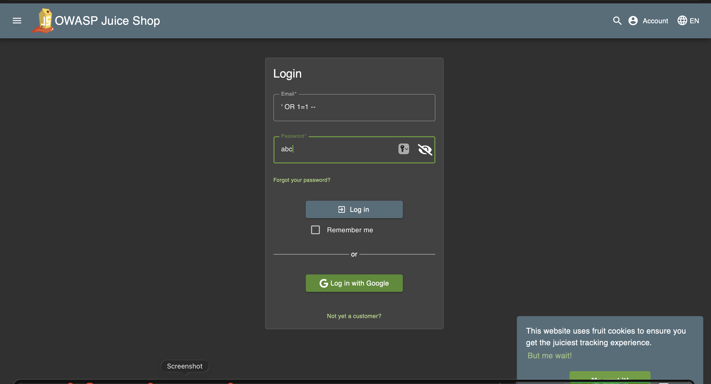
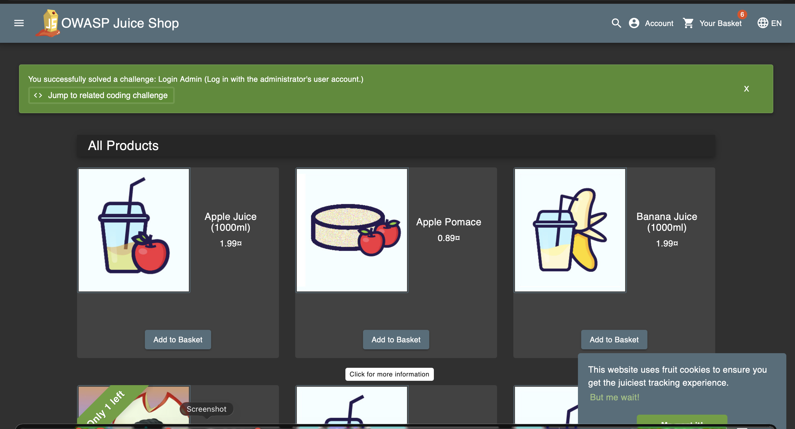
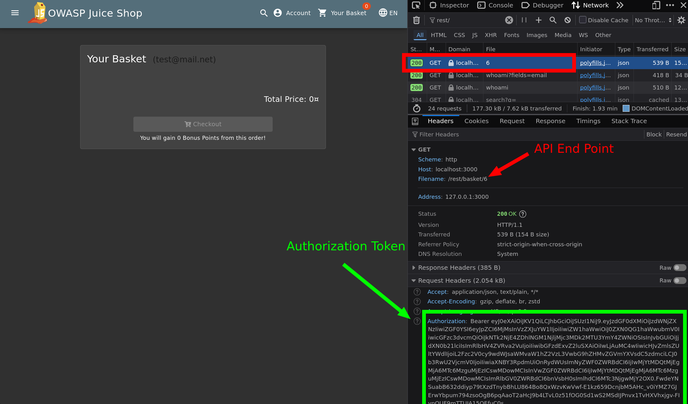
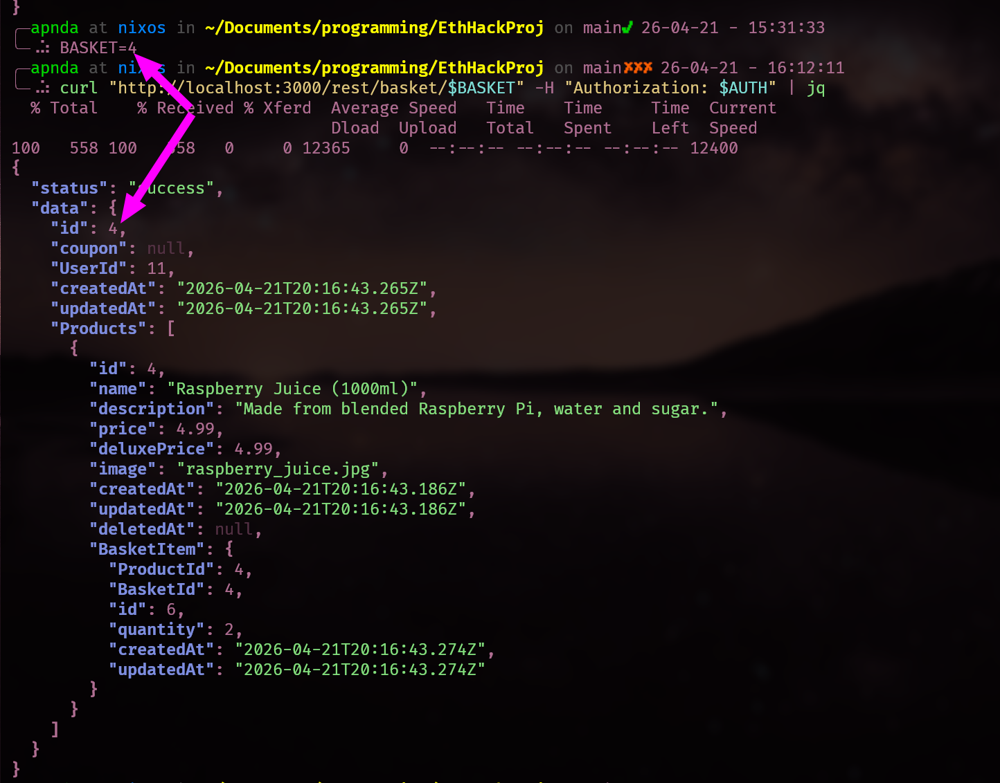

# EH-Web-Application-Auditing-Project Final project for Ethical Hacking 44481

Participants:  

- Ash Atwell  
- Abdul Moiz  
- Carson Stockdale  

Introduction: OWASP Juice Shop is an application that contains many
intentional vulnerabilities.   

## Setup for Kali  

- Update your system: 
    `sudo apt update && sudo apt upgrade -y`
- Install docker: 
    `sudo apt install docker.io -y`
- To check version: 
    `sudo docker --version`
- Download and run: 
    `sudo docker run -d -p 3000:3000 bkimminich/juice-shop`
     
To access juice shop, go to your browser and type: http://localhost:3000   


# XSS 

## Description
These two challenges demonstrated that cross site scripting (XSS) was possible on the website. 

## Payload Used
DOM XSS: <iframe src="javascript:alert('xss')">

Bonus Payload: <iframe width="100%" height="166" scrolling="no" frameborder="no" allow="autoplay" src="https://w.soundcloud.com/player/?url=https%3A//api.soundcloud.com/tracks/771984076&color=%23ff5500&auto_play=true&hide_related=false&show_comments=true&show_user=true&show_reposts=false&show_teaser=true"></iframe>

## Steps Performed
1. Opened the Juice Shop application in the browser
2. Navigated to the search bar
3. Placed the JavaScript payload
4. Press search

## Result
There was clear indication that XSS was performed, as the DOM XSS stack produced an alert to the user, and the bonus payload displayed the SoundCloud viewer built in the webpage.

## Explanation
The search bar input field did not properly sanitize the sensitive input text in the payload. This causes the browser to interpret the text as code, not as data.

## Impact
Attackers can inject malicious script into trusted websites. When other users visit the compromised page, their browser executes that malicious code. 

## Remediation
These injections exist because of improper sanitation on the input field of the website. While there is sanitation implemented in place in other parts of the website, for example the account profile username field, it was not implemented in the search bar, where the payload was injected.

## Screenshots



# Login via SQL Injection

## Description

In this part, I tested the login functionality of OWASP Juice Shop to check for
SQL injection vulnerabilities. The goal was to determine whether the
application properly validates and handles user input during authentication.

## Payload Used

`' OR 1=1 --`

## Steps Performed

1. Opened the OWASP Juice Shop application in the browser  
2. Navigated to the login page  
3. Entered the SQL injection payload in the email field  
4. Entered a random value in the password field  
5. Submitted the login form  

## Result

The application allowed login without valid credentials. This confirms that the
authentication mechanism is vulnerable to SQL injection and can be bypassed.

## Explanation

Normally, the application checks whether the email and password entered by the
user match the records stored in the database. However, when the payload `' OR
1=1 --` is entered, it changes the logic of the SQL query.

Instead of checking for a specific user, the condition becomes true for all
records because `1=1` is always true. The `--` symbol comments out the rest of
the query, so the password check is ignored. As a result, the system grants
access without verifying real credentials.

## Impact

This vulnerability allows an attacker to bypass authentication and gain
unauthorized access to the application. It can lead to exposure of user data,
account takeover, and further exploitation of the system. This is considered a
high severity security issue.

## Remediation

The vulnerability occurs because user input is directly inserted into SQL
queries without proper handling.

To fix this issue:

- Use parameterized queries (prepared statements) so that user input is treated
  strictly as data and not executable SQL  
- Avoid building SQL queries using string concatenation, as this allows
  attackers to inject malicious input  
- Validate and sanitize all user inputs on the server side to ensure they
  follow expected formats  
- Implement proper error handling so sensitive database errors are not exposed
  to users  
- Apply least-privilege database access to minimize potential damage if an
  attack occurs  

## Example Fix

Vulnerable approach: `SELECT * FROM users WHERE email = 'user_input' AND
password = 'password'`


This directly inserts user input into the SQL query.

Secure approach: `SELECT * FROM users WHERE email = ? AND password = ?`


In this version, placeholders are used and the input is passed separately. This
ensures that the database treats the input as plain data instead of SQL code,
preventing injection attacks.

### Screenshots








# Get Baskets

## Description

In this section we test the access control of the user's basket data. The
intention was to see if there is any way to fetch data that does not belong to
the requesting user.

## Execution

```{.bash} # Get you token from cookies or from the get request in the
networking tab export BASKET=4 AUTH="YOUR_AUTH_TOKEN" curl
"http://localhost:3000/rest/basket/$BASKET" -H "Authorization: $AUTH" | jq #
just makes it pretty ```

## Discovery 

1. Create an account
1. Login
1. Go to the basket page 
1. Inspect the page
1. Go to the Network tab in the Inspector
1. Reload the page 
1. Find the `GET` request that represents your BasketID (6)
1. Grab the Authorization Token
1. Export the variables
1. Run `curl`

## Result

When you run the curl command you are returned with a JSON representation of
the basket.

## Impact 

This allows malicious actors to view, and potentially edit, what items are in
another user's basket. This can cause financial implications as well as leaking
user's sensitive data.

## Remediation

When the user requests from the API for the basket's contents, you should only
get the basket assigned to the user's Authorization Token. The end user should
never be exposed to what their BasketID is. If you need to know that
information you should check on request if that user owns that basket.

## Screenshots

 

